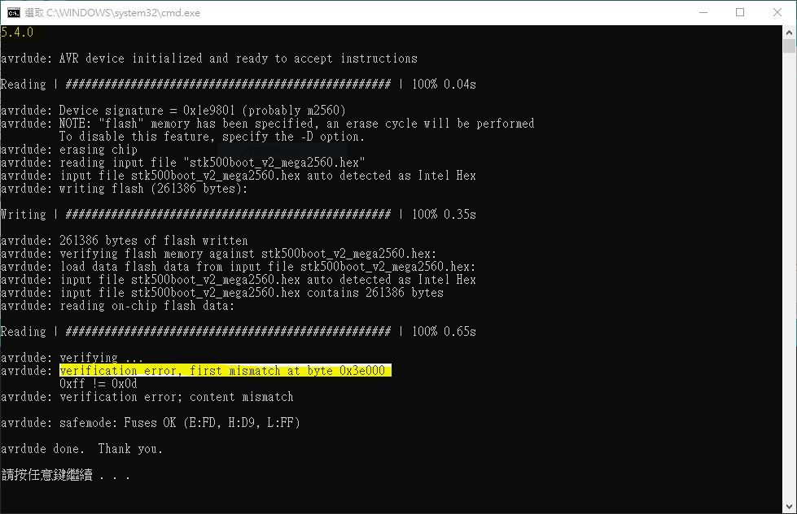
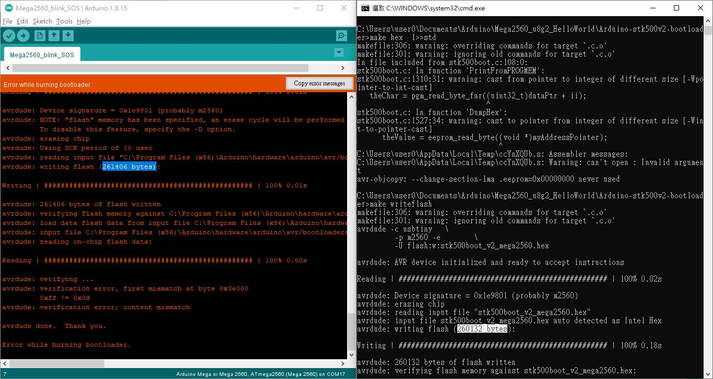

# usbtiny-or-usbasp-mega2560-error-0x3e000
avrdude: verification error, first mismatch at byte 0x3e000, mega2560 and the usbtiny programmer  


output and the message,  

  


```
5.4.0

avrdude: AVR device initialized and ready to accept instructions

Reading | ################################################## | 100% 0.02s

avrdude: Device signature = 0x1e9801 (probably m2560)
avrdude: NOTE: "flash" memory has been specified, an erase cycle will be performed
         To disable this feature, specify the -D option.
avrdude: erasing chip
avrdude: reading input file "stk500boot_v2_mega2560.hex"
avrdude: input file stk500boot_v2_mega2560.hex auto detected as Intel Hex
avrdude: writing flash (261386 bytes):

Writing | ################################################## | 100% 0.23s

avrdude: 261386 bytes of flash written
avrdude: verifying flash memory against stk500boot_v2_mega2560.hex:
avrdude: load data flash data from input file stk500boot_v2_mega2560.hex:
avrdude: input file stk500boot_v2_mega2560.hex auto detected as Intel Hex
avrdude: input file stk500boot_v2_mega2560.hex contains 261386 bytes
avrdude: reading on-chip flash data:

Reading | ################################################## | 100% 0.22s

avrdude: verifying ...
avrdude: verification error, first mismatch at byte 0x3e000
         0xff != 0x0d
avrdude: verification error; content mismatch

avrdude: safemode: Fuses OK (E:FD, H:D8, L:FF)

avrdude done.  Thank you.

請按任意鍵繼續 . . .
```


### this is why, look at the soruce code of usbtiny  

https://forum.arduino.cc/t/help-bricked-my-ardunio-mega2560-rev-3/100686/17  
bootloader for Mega2560 is addressed at 0x0003e000  
usbtiny or usbasp only designed with address of uint (16bit) 0x0000ffff  

unless change the usbtiny firmware design, this could be no solution.  

### questions  
why burn bootloader has no error ?
why verifying is seeing the error ?


### source code and author for the goodhex\stk500boot_v2_mega2560.hex  
it is about 21kb of hex file, burn to the chip is about 261386 bytes  
https://github.com/haarer/Arduino-stk500v2-bootloader    
https://haarer.github.io/arduino,bootloader/2018/03/25/building-an-arduino-mega-2560-bootloader.html    


### compile my own bootloader, change the Makefile, rename to stk500boot_v3_mega2560.hex
try to build bootloader, uses microchip compiler
https://www.microchip.com/en-us/development-tools-tools-and-software/gcc-compilers-avr-and-arm
AVR 8-bit Toolchain v3.62 – Windows 	6/24/2019 	45 MB

installed and show 
```
avr-gcc -v
```
gcc version 5.4.0 (AVR_8_bit_GNU_Toolchain_3.6.2_1778)


### Makefile and modification,  
-Wl,--section-start=.text=$(BOOTLOADER_ADDRESS)  
add this to specify the image burn to address 0x3e000 for Mega2560 and bootlaoder  
0x1e000 should be for Mega1280, no device to try  

```
# linker
LDFLAGS=-Wl,-Map,$(TRG).map -mmcu=$(MCU) \
	-lm $(LIBS) -Wl,--section-start=.text=$(BOOTLOADER_ADDRESS)
```

-DF_CPU=$(F_CPU)UL  
add this to compiler flags  
```
# compiler
CFLAGS=-I. $(INC) -g -mmcu=$(MCU) -O$(OPTLEVEL) \
	-fpack-struct -fshort-enums             \
	-funsigned-bitfields -funsigned-char    \
	-Wall -Wstrict-prototypes               \
	-DF_CPU=$(F_CPU)UL						\
	-Wa,-ahlms=$(firstword                  \
	$(filter %.lst, $(<:.c=.lst)))
```


### how to build and burn bootloader  
run build.bat  
it will uses avr-gcc to compile stk500boot.c, build the hex, stk500boot_v3_mega2560.hex  
usbtiny to burn hex to mega2560 via ISP header  

bootloader size is about 18KB of hex, about 26000 Byte, smaller and response is faster than stk500boot_v2_mega2560.hex, does not it!?  

  

